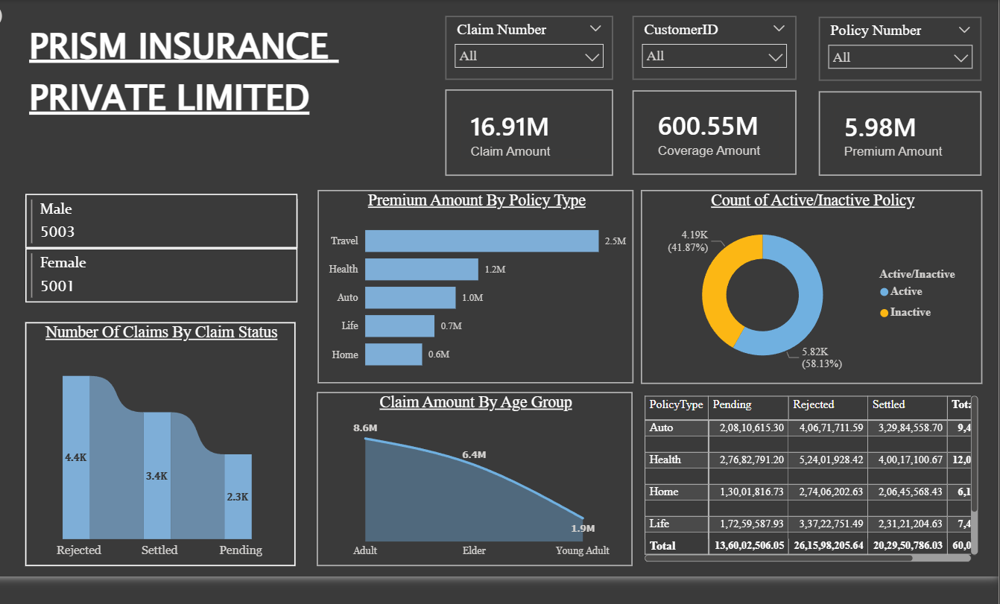

# PRISM Insurance Dashboard – Power BI

Interactive Power BI dashboard analyzing **800+ insurance policies** across multiple policy types including Auto, Health, Travel, Life, and Home.  
The dashboard tracks **claims, premiums, demographics, and policy performance** to generate business insights.

---

## Dashboard Preview



---

## Dataset Overview

| Column | Description |
|------|-------------|
| PolicyNumber | Unique policy identifier |
| CustomerID | Customer ID |
| Gender | Male / Female |
| Age | Customer age |
| PolicyType | Auto, Health, Travel, Life, Home |
| PremiumAmount | Annual premium amount |
| CoverageAmount | Policy coverage value |
| ClaimAmount | Claim settlement amount |
| ClaimStatus | Settled / Pending / Rejected |

Dataset contains **800 rows and 13 columns**.

---

## Key Dashboard Metrics

- Total Policies Analyzed: **800+**
- Claim Status Tracking
- Customer Demographics
- Premium vs Coverage analysis
- Claims by policy type
- Age distribution analysis

---

## Business Insights

- Travel policies show the **highest policy volume**
- Health and Auto policies generate **more claim requests**
- Majority of policy holders fall between **age 40–60**
- Most claims are **successfully settled**

---

## Skills Demonstrated

- Power BI Dashboard Development
- Data Cleaning & Data Modeling
- DAX Calculations
- Business KPI Visualization
- Insurance Data Analysis

---

## Repository Files

```
InsuranceData.csv        → Dataset
Prism Insurance.pbix     → Power BI Dashboard
main-dashboard.png       → Dashboard Screenshot
README.md                → Project Documentation
```

---

## Author

**Megha Kallapur**

GitHub: https://github.com/Megha-B-K  
Email: meghakallapur22@gmail.com
